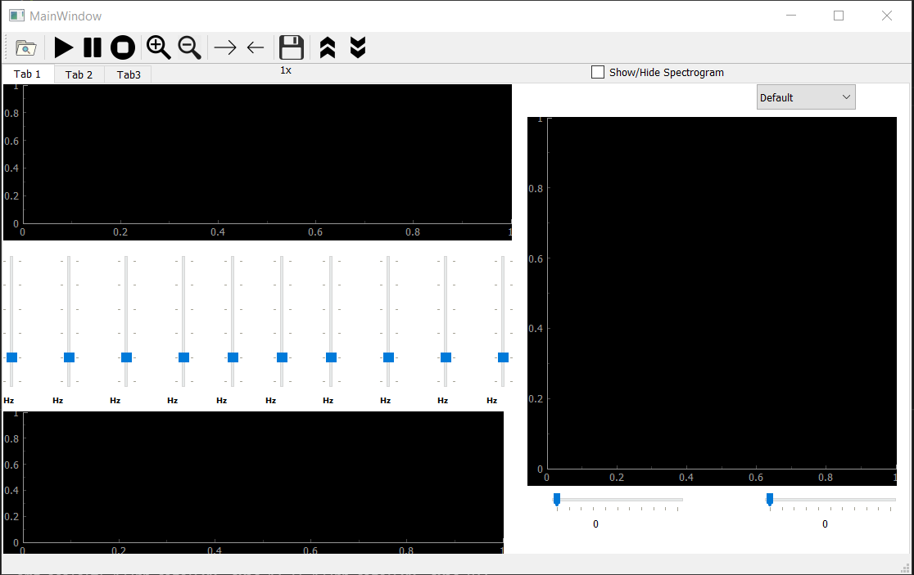
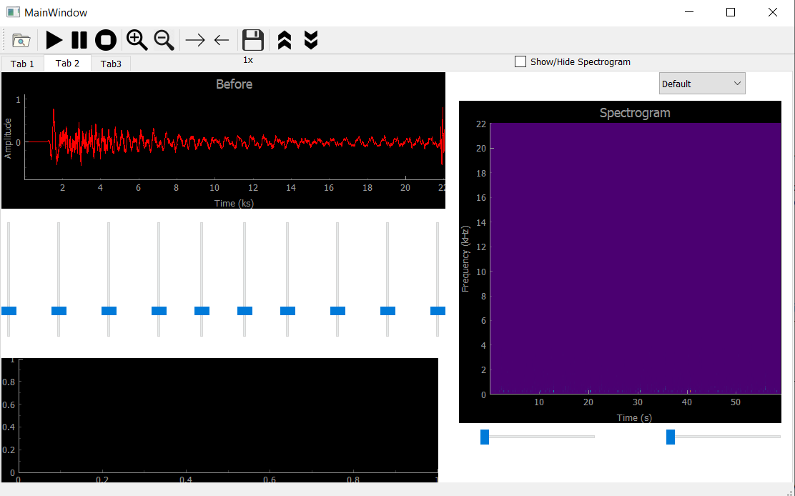
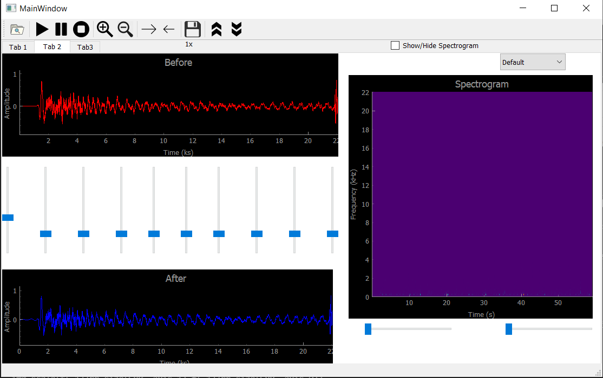
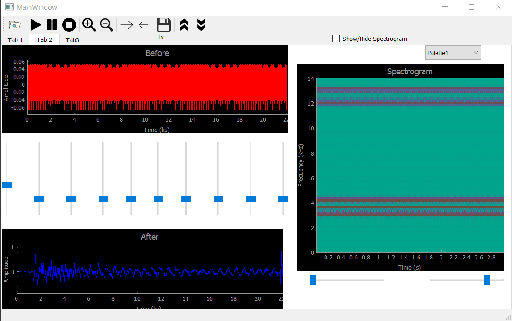
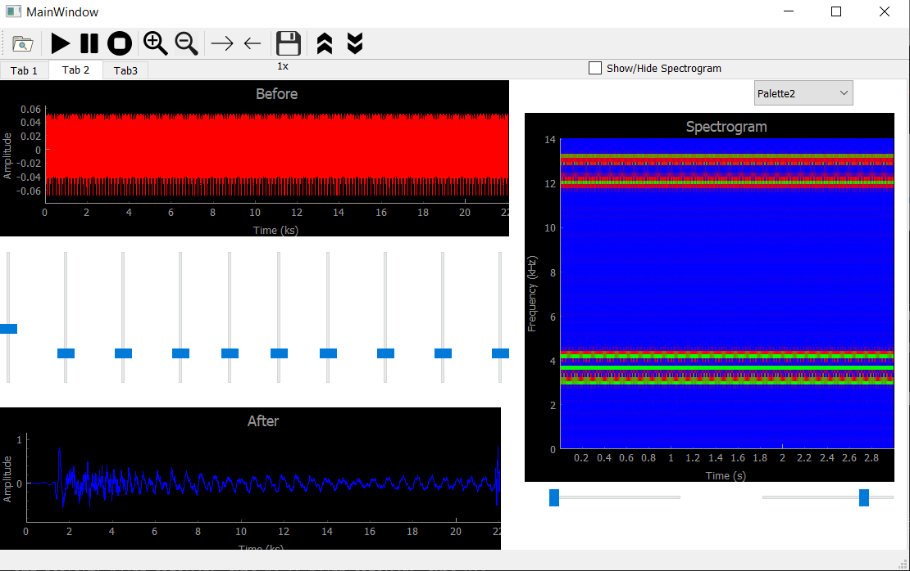
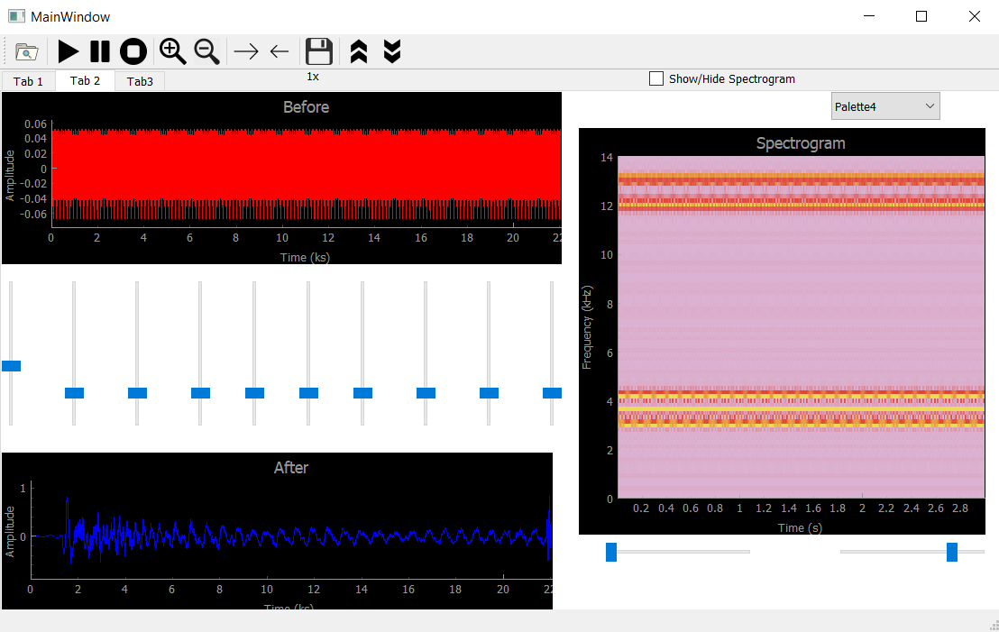

# Sound-Equalizer

Sound equalizer is a basic tool in the music industry. It also serves in several biomedical applications like hearing aid industry.

To run the application please write this command in your terminal.
```terminal
 python Equalizer.py
```


When the user runs the program, the main window will be like :



- The two signal viewers should display the signal “before” and “after” the equalization actions. 
- The equalizer panel contains 10 sliders, each control the gain of 1/10 of the bandwidth of the frequency domain. The default value of each slider is 1 (i.e. the corresponding BW of the signal remain as is) and can go up to 5 and drop down to 0.

When the user chooses an audio file it appears on the window with it's histogram being plotted.



When the sliders are move the signal after equaliztion will appear in the second window.



The user can also change the pallete colors of the histogram.







Finally we applied multiple features on our signals like you can play, pause, shift right, shift left, zoom in, zoom out, and clearing. You just press any operation you want and you will find the result.


